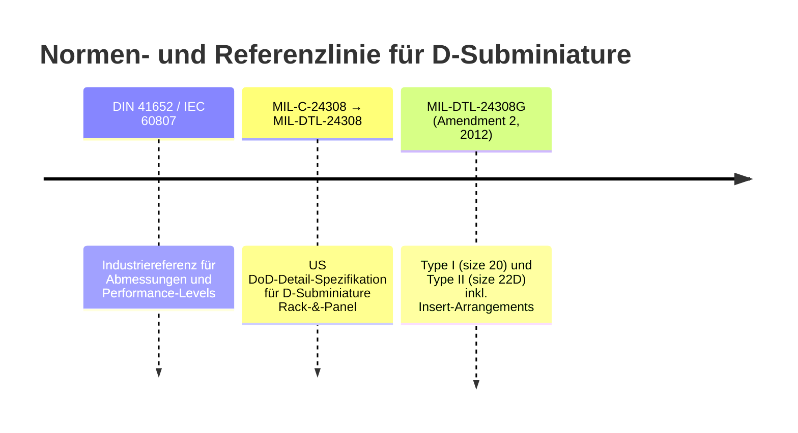
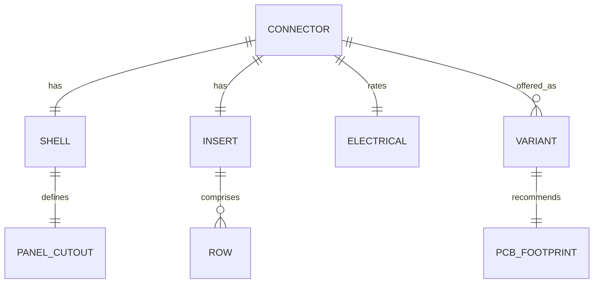

# Technische Referenzdaten und standardisiertes Datenschema für D‑Sub‑Steckverbinder

## Executive Summary

Dieser Bericht konsolidiert normative und herstellerbasierte Referenzdaten für zehn D‑Sub‑Varianten: **DE‑9, DA‑15, DB‑25, DC‑37, DD‑50** (Standard/„Normal Density“) sowie **DE‑15 (HD15), DA‑26 (HD26), DB‑44 (HD44), DC‑62 (HD62), DD‑78 (HD78)** (High‑Density). Die Daten wurden so strukturiert, dass sie **direkt als maschinenlesbares Schema (YAML/JSON) verwendbar** sind, und zugleich als **mechanisch belastbare Grundlage** für Panel‑Ausschnitte, Bohrbilder, SVG‑Frontansichten und PCB‑Footprints dienen. Die wichtigste normative Grundlage ist **MIL‑DTL‑24308G (Amendment 2)**, die **Standard‑ (Type I, Size‑20‑Kontakte) und High‑Density‑Ausführungen (Type II, Size‑22D‑Kontakte)** explizit unterscheidet. citeturn2view0

Zwei systematische Abweichungscluster wurden identifiziert und validiert: Erstens sind **Kontakt‑Rastermaße** in Herstellerdaten oft als **2,77 mm/2,84 mm** angegeben, während MIL‑Zeichnungen für die Kontaktfelder häufig **0,108″/0,112″** (→ **2,743 mm/2,845 mm**) verwenden; der Unterschied ist klein (≈0,03 mm), aber bei CAD/SVG‑Automatisierung relevant und wird im Schema als „nominal“ plus „alternative/rounded“ geführt. citeturn5view0turn14view0turn13view0 Zweitens sind High‑Density‑Felder **nicht überall gleich**: Für HD15/HD26/HD44 ist horizontal typischerweise **0,090″ (2,286 mm)**, während für HD62/HD78 (größere Shells) häufig **0,095″ (2,413 mm)** verwendet wird; HD78 ist zudem **4‑reihig** und nutzt eine andere vertikale Teilung (**0,082″/2,083 mm**) als die 3‑reihigen HD‑Varianten (**0,078″/1,981 mm). citeturn13view1turn5view4turn5view6turn7search2turn6search10

Für alle Varianten sind die **Flansch‑Außenmaße und Lochabstände** primär eine Funktion der **Shell‑Size (E/A/B/C/D)**. Als robuste, herstellernahe Geometriequelle für Flansch‑Maße und Montageoptionen dient ein ITT‑Cannon‑Katalogblatt (Engaging‑Face‑Bemaßung inkl. Ø3,05 mm Montagebohrung, 10°‑Trapezwinkel, A/B/C/D/E‑Maße). citeturn9view2turn9view0 Für Panel‑Ausschnitte und PCB‑Bohrbilder (inkl. Trapez‑Breiten oben/unten) wird ergänzend ein Board‑&‑Panel‑Cutout‑Leitblatt genutzt, das Standard und High‑Density abdeckt. citeturn13view0turn13view1

## Normenlage und Quellenbasis

Die Kernnormenlandschaft lässt sich in zwei Familien gliedern: (a) **US‑militärische Detail‑Spezifikation MIL‑DTL‑24308** (historisch MIL‑C‑24308) für „rack and panel“ D‑Subminiature‑Steckverbinder sowie (b) **IEC/DIN‑basierte Industriestandards** (häufig als IEC 60807‑2 / DIN 41652 referenziert). Hersteller beschreiben die Intermateability regelmäßig über diese Normenreferenzen. citeturn2view0turn1search19turn16search22

Als Primärquellen (Maße/Layouts/Material) wurden u. a. Datenblätter/Kataloge von entity["company","TE Connectivity","connector manufacturer"], entity["company","Amphenol","connector manufacturer"], entity["company","HARTING","connector manufacturer"], entity["company","ITT Cannon","connector manufacturer"], entity["company","Hirose Electric","connector manufacturer"] und entity["company","CONEC","connector manufacturer"] herangezogen; als normativ‑technische Basen dienen zusätzlich die MIL‑Spezifikation sowie herstellerunabhängige Cutout‑/Bohrbild‑Referenzen. citeturn2view0turn9view2turn13view0turn16search17

### Mermaid‑Timeline der referenzierten Standardlinien



DIN/IEC‑Bezüge werden exemplarisch in deutschen Hersteller-/Industrie‑Datenblättern genannt (z. B. „Connector according to IEC 60807‑2/DIN 41652“), während MIL‑DTL‑24308G die detaillierte Typisierung und Prüfspannungstabellen liefert. citeturn1search19turn2view0turn20view0

## Standardisiertes Datenschema

Das folgende Schema ist so entworfen, dass es drei Ebenen sauber trennt:

1) **Shell‑Geometrie (familienweit pro Shell‑Size)**: Flanschmaße, Montagebohrungen, Panel‑Cutout‑Trapez.
2) **Insert/Contact‑Geometrie (abhängig von Pin‑Count & Density)**: Reihenanzahl, Pitch, Versatz, Nummerierung.
3) **Variant‑Layer (hersteller-/artikelabhängig)**: Gesamttiefe, Termination‑Style (Solder‑cup/Crimp/PCB‑THT/SMT), Boardlocks, Gewindeart, elektrische Ratings.

### Mermaid‑ER‑Modell



### Generisches YAML‑Skelett

```yaml
id: "de-9-standard"
designation: "DE-9"
family: "d-subminiature"
density: "standard"          # standard | high_density
shell:
  letter: "E"                # E|A|B|C|D
  mil_shell_size: 1          # 1..5 (Mapping: 1=E, 2=A, 3=B, 4=C, 5=D)
  flange:
    outer_width_mm: null
    outer_height_mm: null
    thickness_mm: "nicht spezifiziert"
    mounting:
      hole_spacing_mm: null
      hole_diameter_mm: null
      thread_options: ["4-40 UNC", "M3"]
  panel_cutout_trapezoid:
    top_width_mm: null
    bottom_width_mm: null
    height_mm: null
    side_angle_deg: 10
    corner_radius_mm: "nicht spezifiziert"
insert:
  total_contacts: null
  contact_size: "20"         # "20" (Type I) | "22D" (Type II)
  rows: null
  contacts_per_row: []
  pitch_mm:
    x: null
    y: null
  row_offset_mm: null
  numbering:
    front_view: "..."
    solder_side_view: "..."
contacts:
  male_pin_diameter_mm: {min: null, max: null}
  female_entry_diameter_mm: {min: null}
pcb_footprint:
  contact_hole_finished_mm: null
  contact_pad_diameter_mm: null
  pad_shape: "round (Pin 1 rect)"
  contacts_plated: "PTH"
  mounting_holes: "NPTH (typisch; variiert)"
electrical:
  max_current_per_contact_a: null
  dielectric_withstand_v_rms_60hz:
    sea_level: null
  working_voltage_v: "nicht spezifiziert (serienabhängig)"
  contact_material: "kupferlegierung (typisch)"
  plating: "Au über Ni (typisch; serienabhängig)"
standards:
  - "MIL-DTL-24308"
  - "IEC 60807-2"
  - "DIN 41652"
sources:
  - "nicht spezifiziert (siehe Berichtszitate)"
```

## Normative Referenzmaße und Validierungslogik

### Referenzsicht und Nummerierung

MIL‑DTL‑24308‑Insert‑Arrangements sind als **Kontakt‑Layout mit Pin‑Nummern** angegeben; die Zahlenfolge ist in den dargestellten Reihen jeweils **links→rechts auf der Mating‑Face‑/Front‑View** geführt. citeturn5view0turn5view2turn5view5turn5view6  
Für die **Lötseite/Rear‑View** gilt in der Praxis: Betrachtet man denselben Steckverbinder von hinten (Lötseite), ist die Front‑Nummerierung **horizontal gespiegelt** (links↔rechts), weil die Betrachtungsrichtung invertiert wird.

### Kontaktgrößen und Pin‑Durchmesser (normativ, Größenklasse)

MIL‑DTL‑24308 Appendix B spezifiziert Kontaktgeometrien für **Size‑20** und **Size‑22D** (solder type, non‑removable):  
* Size‑20 Pin‑Durchmesser **0,039″–0,041″** (→ **0,991–1,041 mm**) und Socket‑Entry **≥0,042″** (→ **≥1,067 mm**). citeturn11view0turn11view1  
* Size‑22D Pin‑Durchmesser **0,0295″–0,0305″** (→ **0,749–0,775 mm**) und Socket‑Entry **≥0,0345″** (→ **≥0,876 mm**). citeturn11view1

### Prüfspannungen (DWV) nach MIL‑DTL‑24308

Für **Type I und Type II** nennt die MIL‑Spezifikation Prüfspannungen (60 Hz, RMS), ausdrücklich **„not working voltages“**: bei Sea Level typ. **1000 V** (all other conditions) für Klassen G/D/M/N und **750 V** für H/K; humidity‑conditioned **600 V** bzw. **400 V**. citeturn20view0

### Shell‑Geometrie (Flansch) als robuste Herstellerreferenz

Die Flansch‑Außenmaße und Montagebohrungs‑Abstände sind in Herstellerkatalogen konsistent pro Shell‑Size. Ein ITT‑Cannon‑Engaging‑Face‑Blatt zeigt die Standard‑Shells **DE/DA/DB/DC/DD** mit **10°**‑Trapezwinkel sowie **Montagebohrung Ø3,05 mm** und den maßgeblichen A/C/E‑Mission‑Maßen (A=Flanschbreite, E=Flanschhöhe, C=Lochabstand). citeturn9view2turn9view0

Die Panel‑Cutout‑Trapezbreiten (oben/unten) und Cutout‑Höhen lassen sich herstellerunabhängig aus einer Board‑&‑Panel‑Cutout‑Referenz ableiten; dort sind pro Shell‑Size sowohl **Cutout‑Top‑Width (B)** als auch **Cutout‑Bottom‑Width (C)** sowie **Höhe (E)** und **Eckenradius (G)** tabelliert. citeturn13view0

## Datenblätter und Tabellen je Steckertyp

Hinweis zur Benennung: In der Anfrage steht „DC87 (Standard) (37)“. Der übliche D‑Sub‑Name für 37 Kontakte ist **DC‑37** (Shell C). Die folgenden Tabellen nutzen die markt‑/normkonforme Schreibweise.

### DE‑9 (Standard, 9 Kontakte)

| Feld | Wert |
|---|---|
| Offizielle Bezeichnung | DE‑9 |
| Shell size letter | E |
| Density | standard (Type I, Size‑20‑Kontakte). citeturn2view0 |
| Gesamtanzahl Pins | 9 |
| Reihenanzahl | 2 |
| Pins pro Reihe | 5‑4. citeturn5view0 |
| Pin‑Layout/Nummerierung Front | Reihe 1: 1–5 (links→rechts); Reihe 2: 6–9 (links→rechts). citeturn5view0 |
| Pin‑Layout/Nummerierung Lötseite | Rear‑View ≈ horizontal gespiegelt: Reihe 1: 5–1; Reihe 2: 9–6 (Interpretationsregel; nicht separat in MIL gezeichnet). citeturn5view0 |
| Pin pitch X (mm) | **2,743 mm** (0,108″). Alternative Rundung in Herstellerblättern häufig **2,770 mm**. citeturn5view0turn14view0turn13view0 |
| Pin pitch Y (mm) | **2,845 mm** (0,112″). Alternative Rundung häufig **2,840 mm**. citeturn5view0turn14view0turn13view0 |
| Reihenversatz/Offset (mm) | **1,372 mm** (0,054″). citeturn5view0 |
| Pin‑Durchmesser male/female (mm) | Male pin Ø **0,991–1,041 mm**; Female entry Ø **≥1,067 mm** (Size‑20). citeturn11view0turn11view1 |
| Flansch Außenmaß (Breite×Höhe) | **30,81×12,55 mm** (Shell DE/E). citeturn9view2 |
| Flanschdicke (mm) | nicht spezifiziert (stark hersteller-/serienabhängig) |
| Montagelochabstand (center‑to‑center) | **24,99 mm**. citeturn9view2turn13view0 |
| Montagelochdurchmesser / Gewinde | **Ø3,05 mm** Durchgangsloch; Gewinde‑Varianten typ. **4‑40 UNC** oder **M3** (Serien-/Region‑Option). citeturn9view2turn9view0turn14view0 |
| Shell‑Trapezmaße | Panel‑Cutout‑Trapez (Referenz): oben **12,49 mm**, unten **19,74 mm**, Höhe **11,18 mm**, Winkel **10°**, Corner‑Radius **3,81 mm**. citeturn13view0 |
| Gesamttiefe/Gehäusetiefe (mm) | nicht spezifiziert (termination-/mount‑abhängig; in Produktdatenblättern variierend) |
| PCB‑Footprint‑Empfehlungen | Kontakt‑Bohrung finished typ. **≈1,016 mm** (0,040″) in Bohrbild‑Referenzen; PTH. Pad‑Ø empfohlen **≈1,8 mm** (Ring ≥0,15 mm + Fertigungsspielraum als Praxiswert). citeturn13view1turn19search12 |
| Elektrische Kenndaten | DWV‑Test (Type I/II): bis **1000 V RMS** (nicht Arbeits­spannung). Strom typ. **bis 5 A/Kontakt** (Standard Density als verbreitete Herstellerangabe). citeturn20view0turn1search4 |
| Kontaktmaterial | Kupferlegierung, häufig Au‑Plattierung über Ni (serienabhängig; Beispiel: TE nennt Phosphor‑Bronze‑Basis, Au/Ni). citeturn14view0 |
| Gender‑/Mount‑Varianten | Plug/Receptacle; Panel‑Mount; PCB‑THT (vertical/right‑angle); Solder‑cup; Crimp; IDC (serienabhängig). citeturn16search15turn2view0 |
| Relevante Normen/Standards | MIL‑DTL‑24308; IEC 60807‑2 / DIN 41652 (Intermateability‑Referenzen in Industrieblättern). citeturn2view0turn1search19 |
| Typische Herstellerlinks | TE/Amphenol/HARTING/ITT‑Cannon Produktlinien und Datenblätter (siehe Zitierquellen oben). citeturn14view0turn9view2turn17view0 |

Kurzvalidierung/Abweichungen: Das Kontakt‑Raster wird in MIL‑Arrangements häufig als 0,108″/0,112″ geführt (2,743/2,845 mm), während Herstellerseiten oft 2,77/2,84 mm angeben (Rundung/anderer Nennwert). Für CAD‑Automatisierung empfiehlt sich, beide als „nominal“ vs. „rounded“ zu speichern. citeturn5view0turn14view0turn13view0

Beispiel‑YAML (kompakt):

```yaml
id: "de-9-standard"
designation: "DE-9"
density: "standard"
shell: {letter: "E", mil_shell_size: 1}
insert:
  total_contacts: 9
  contact_size: "20"
  rows: 2
  contacts_per_row: [5, 4]
  pitch_mm: {x: 2.743, y: 2.845}
  row_offset_mm: 1.372
  numbering:
    front_view: "row1 1-5; row2 6-9"
    solder_side_view: "mirrored: row1 5-1; row2 9-6"
contacts:
  male_pin_diameter_mm: {min: 0.991, max: 1.041}
  female_entry_diameter_mm: {min: 1.067}
flange:
  outer_mm: [30.81, 12.55]
  mounting_hole_spacing_mm: 24.99
  mounting_hole_diameter_mm: 3.05
panel_cutout_trapezoid_mm:
  top_width: 12.49
  bottom_width: 19.74
  height: 11.18
  side_angle_deg: 10
  corner_radius: 3.81
electrical:
  max_current_a_per_contact: 5
  dielectric_withstand_v_rms_60hz_sea_level: 1000
standards: ["MIL-DTL-24308", "IEC 60807-2", "DIN 41652"]
```

### DA‑15 (Standard, 15 Kontakte)

| Feld | Wert |
|---|---|
| Offizielle Bezeichnung | DA‑15 |
| Shell size letter | A |
| Density | standard (Type I, Size‑20). citeturn2view0 |
| Gesamtanzahl Pins | 15 |
| Reihenanzahl | 2 |
| Pins pro Reihe | 8‑7. citeturn5view1 |
| Pin‑Layout/Nummerierung Front | Reihe 1: 1–8; Reihe 2: 9–15 (jeweils links→rechts). citeturn5view1 |
| Pin‑Layout/Nummerierung Lötseite | gespiegelt: Reihe 1: 8–1; Reihe 2: 15–9 (Interpretationsregel). citeturn5view1 |
| Pin pitch X (mm) | 2,743 mm (0,108″) nominal; häufig 2,770 mm gerundet in Herstellerangaben. citeturn5view1turn14view0turn13view0 |
| Pin pitch Y (mm) | 2,845 mm (0,112″) nominal; häufig 2,840 mm gerundet. citeturn5view1turn14view0turn13view0 |
| Reihenversatz/Offset (mm) | 1,372 mm (0,054″). citeturn5view1 |
| Pin‑Durchmesser male/female (mm) | wie Size‑20: male 0,991–1,041 mm; female entry ≥1,067 mm. citeturn11view0turn11view1 |
| Flansch Außenmaß (Breite×Höhe) | 39,14×12,55 mm. citeturn9view2 |
| Flanschdicke (mm) | nicht spezifiziert |
| Montagelochabstand | 33,32 mm. citeturn9view2turn13view0 |
| Montagelochdurchmesser / Gewinde | Ø3,05 mm (Durchgang); Gewindeoptionen 4‑40 UNC / M3 je nach Serie. citeturn9view2turn14view0 |
| Shell‑Trapezmaße | Panel‑Cutout‑Referenz: oben 16,66 mm, unten 28,07 mm, Höhe 11,18 mm, 10°, Radius 3,81 mm. citeturn13view0 |
| Gesamttiefe/Gehäusetiefe (mm) | nicht spezifiziert |
| PCB‑Footprint‑Empfehlungen | Kontaktbohrung typ. ≈1,016 mm; PTH, Pad‑Ø ≈1,8 mm empfohlen (Praxis). citeturn13view1turn19search12 |
| Elektrische Kenndaten | DWV‑Test wie Type I/II bis 1000 V RMS (kein Arbeitswert). Strom typ. bis 5 A/Kontakt. citeturn20view0turn1search4 |
| Kontaktmaterial | typisch Kupferlegierung, Au über Ni (serienabhängig). citeturn14view0 |
| Gender‑/Mount‑Varianten | Plug/Receptacle; Panel/PCB; solder‑cup/crimp/IDC. citeturn16search15turn2view0 |
| Relevante Normen | MIL‑DTL‑24308; IEC 60807‑2/DIN 41652. citeturn2view0turn1search19 |

Beispiel‑YAML:

```yaml
id: "da-15-standard"
designation: "DA-15"
density: "standard"
shell: {letter: "A", mil_shell_size: 2}
insert:
  total_contacts: 15
  contact_size: "20"
  rows: 2
  contacts_per_row: [8, 7]
  pitch_mm: {x: 2.743, y: 2.845}
  row_offset_mm: 1.372
  numbering: {front_view: "row1 1-8; row2 9-15", solder_side_view: "mirrored"}
```

### DB‑25 (Standard, 25 Kontakte)

| Feld | Wert |
|---|---|
| Offizielle Bezeichnung | DB‑25 |
| Shell size letter | B |
| Density | standard (Type I, Size‑20). citeturn2view0 |
| Gesamtanzahl Pins | 25 |
| Reihenanzahl | 2 |
| Pins pro Reihe | 13‑12. citeturn5view2 |
| Pin‑Layout/Nummerierung Front | Reihe 1: 1–13; Reihe 2: 14–25 (links→rechts). citeturn5view2 |
| Pin pitch X/Y, Offset | X 2,743 mm; Y 2,845 mm; Offset 1,372 mm. citeturn5view2 |
| Pin‑Durchmesser male/female | Size‑20: male 0,991–1,041 mm; female entry ≥1,067 mm. citeturn11view0turn11view1 |
| Flansch Außenmaß | 53,04×12,55 mm. citeturn9view2 |
| Montagelochabstand | 47,04 mm. citeturn9view2turn13view0 |
| Montagelochdurchmesser / Gewinde | Ø3,05 mm (Durchgang); 4‑40 UNC / M3 als Option. citeturn9view2turn14view0 |
| Shell‑Trapezmaße | Panel‑Cutout‑Referenz: oben 23,52 mm, unten 41,78 mm, Höhe 11,18 mm, 10°, Radius 3,81 mm. citeturn13view0 |
| PCB‑Footprint‑Empfehlungen | Kontaktbohrung typ. ≈1,016 mm; PTH; Pad‑Ø ≈1,8 mm empfohlen. citeturn13view1turn19search12 |
| Elektrische Kenndaten | DWV‑Test bis 1000 V RMS; Strom typ. bis 5 A/Kontakt. citeturn20view0turn1search4 |
| Kontaktmaterial | z. B. phosphor bronze + Au/Ni in Herstellerbeispielen. citeturn14view0 |
| Normen | MIL‑DTL‑24308; IEC 60807‑2/DIN 41652. citeturn2view0turn1search19 |

Beispiel‑YAML:

```yaml
id: "db-25-standard"
designation: "DB-25"
density: "standard"
shell: {letter: "B", mil_shell_size: 3}
insert:
  total_contacts: 25
  contact_size: "20"
  rows: 2
  contacts_per_row: [13, 12]
  pitch_mm: {x: 2.743, y: 2.845}
  row_offset_mm: 1.372
  numbering: {front_view: "row1 1-13; row2 14-25", solder_side_view: "mirrored"}
```

### DC‑37 (Standard, 37 Kontakte)

| Feld | Wert |
|---|---|
| Offizielle Bezeichnung | DC‑37 |
| Shell size letter | C |
| Density | standard (Type I, Size‑20). citeturn2view0 |
| Gesamtanzahl Pins | 37 |
| Reihenanzahl | 2 |
| Pins pro Reihe | 19‑18. citeturn5view3 |
| Pin‑Nummerierung Front | Reihe 1: 1–19; Reihe 2: 20–37 (links→rechts). citeturn5view3 |
| Pitch/Offset | X 2,743 mm; Y 2,845 mm; Offset 1,372 mm (nominal nach MIL). citeturn5view3 |
| Pin‑Durchmesser | Size‑20: male 0,991–1,041 mm; female entry ≥1,067 mm. citeturn11view0turn11view1 |
| Flansch Außenmaß | 69,32×12,55 mm. citeturn9view2 |
| Montagelochabstand | 63,50 mm. citeturn9view2turn13view0 |
| Montagelochdurchmesser / Gewinde | Ø3,05 mm Durchgang; Threads 4‑40 UNC / M3 üblich als Varianten. citeturn9view2turn14view0 |
| Shell‑Trapezmaße | Panel‑Cutout‑Referenz: oben 31,75 mm, unten 58,24 mm, Höhe 11,18 mm, 10°, Radius 3,81 mm. citeturn13view0 |
| PCB‑Footprint | Kontaktbohrung typ. ≈1,016 mm PTH; Pad‑Ø ≈1,8 mm empfohlen. citeturn13view1turn19search12 |
| Elektrisch | DWV‑Test bis 1000 V RMS; Strom typ. bis 5 A/Kontakt. citeturn20view0turn1search4 |
| Normen | MIL‑DTL‑24308; IEC 60807‑2/DIN 41652. citeturn2view0turn1search19 |

Beispiel‑YAML:

```yaml
id: "dc-37-standard"
designation: "DC-37"
density: "standard"
shell: {letter: "C", mil_shell_size: 4}
insert:
  total_contacts: 37
  contact_size: "20"
  rows: 2
  contacts_per_row: [19, 18]
  pitch_mm: {x: 2.743, y: 2.845}
  row_offset_mm: 1.372
  numbering: {front_view: "row1 1-19; row2 20-37", solder_side_view: "mirrored"}
```

### DD‑50 (Standard, 50 Kontakte)

| Feld | Wert |
|---|---|
| Offizielle Bezeichnung | DD‑50 |
| Shell size letter | D |
| Density | standard (Type I, Size‑20). citeturn2view0 |
| Gesamtanzahl Pins | 50 |
| Reihenanzahl | 3 |
| Pins pro Reihe | 17‑16‑17. citeturn5view5 |
| Pin‑Nummerierung Front | Reihe 1: 1–17; Reihe 2: 18–33; Reihe 3: 34–50 (jeweils links→rechts). citeturn5view5 |
| Pitch X (mm) | 2,743 mm nominal (0,108″) – Hersteller oft 2,770 mm gerundet. citeturn5view5turn13view0 |
| Pitch Y (mm) | 2,845 mm nominal (0,112″) zwischen benachbarten Reihen; Gesamthöhe über 3 Reihen ≈ 2×2,845 mm. citeturn5view5 |
| Reihenversatz/Offset | 1,372 mm (0,054″) Stagger zwischen benachbarten Reihen (typisch). citeturn13view0turn5view5 |
| Pin‑Durchmesser | Size‑20: male 0,991–1,041 mm; female entry ≥1,067 mm. citeturn11view0turn11view1 |
| Flansch Außenmaß | 66,93×15,37 mm. citeturn9view3turn9view2 |
| Montagelochabstand | 61,11 mm. citeturn9view3turn13view0 |
| Montagelochdurchmesser / Gewinde | Ø3,05 mm (Durchgang) üblich; Threads 4‑40 UNC/M3 als Varianten. citeturn9view3turn14view0 |
| Shell‑Trapezmaße | Panel‑Cutout‑Referenz: oben 30,55 mm, unten 55,63 mm, Höhe 13,97 mm, 10°, Radius 3,81 mm. citeturn13view0 |
| PCB‑Footprint | Kontaktbohrung typ. ≈1,016 mm PTH; Pad‑Ø ≈1,8 mm empfohlen. citeturn13view1turn19search12 |
| Elektrisch | DWV‑Test bis 1000 V RMS; Strom typ. bis 5 A/Kontakt. citeturn20view0turn1search4 |
| Normen | MIL‑DTL‑24308; IEC 60807‑2/DIN 41652. citeturn2view0turn1search19 |

Beispiel‑YAML:

```yaml
id: "dd-50-standard"
designation: "DD-50"
density: "standard"
shell: {letter: "D", mil_shell_size: 5}
insert:
  total_contacts: 50
  contact_size: "20"
  rows: 3
  contacts_per_row: [17, 16, 17]
  pitch_mm: {x: 2.743, y: 2.845}
  row_offset_mm: 1.372
  numbering: {front_view: "row1 1-17; row2 18-33; row3 34-50", solder_side_view: "mirrored"}
```

### DE‑15 (HD15, High Density, 15 Kontakte)

| Feld | Wert |
|---|---|
| Offizielle Bezeichnung | DE‑15 (HD15) |
| Shell size letter | E |
| Density | high_density (Type II, Size‑22D). citeturn2view0 |
| Gesamtanzahl Pins | 15 |
| Reihenanzahl | 3 |
| Pins pro Reihe | 5‑5‑5. citeturn5view0 |
| Pin‑Nummerierung Front | Reihe 1: 1–5; Reihe 2: 6–10; Reihe 3: 11–15 (links→rechts). citeturn5view0 |
| Pin pitch X (mm) | **2,286 mm** (0,090″) typ. für HD15. citeturn13view1 |
| Pin pitch Y (mm) | **1,981 mm** (0,078″) typ. für 3‑row HD. citeturn13view1turn5view0 |
| Reihenversatz/Offset (mm) | **1,143 mm** (0,045″). citeturn13view1 |
| Pin‑Durchmesser male/female | Size‑22D: male 0,749–0,775 mm; female entry ≥0,876 mm. citeturn11view1 |
| Flansch Außenmaß / Lochabstand | wie Shell E: 30,81×12,55 mm; Lochabstand 24,99 mm. citeturn9view2turn13view0 |
| Montageloch Ø / Gewinde | Ø3,05 mm Durchgang (oder 4‑40 UNC/M3 je nach Variante). citeturn9view0turn14view0 |
| Shell‑Trapezmaße | Panel‑Cutout‑Referenz Shell E wie oben (Top 12,49 / Bottom 19,74 / Height 11,18 / 10° / R 3,81). citeturn13view0 |
| PCB‑Footprint‑Empfehlungen | High‑Density‑Bohrbild: Kontakt‑Loch Ø **1,016 mm** (0,040″) als verbreitete Referenz; Montage‑Loch Ø **3,175 mm** (0,125″) in Cutout‑Guides. citeturn13view1turn13view0 |
| Elektrische Kenndaten | Strom typ. **3 A/Kontakt** (HD); DWV‑Test bis 1000 V RMS (kein Arbeitswert). citeturn1search4turn20view0 |
| Kontaktmaterial | typisch Kupferlegierung, Au über Ni (serienabhängig). citeturn15search22turn3search8 |
| Normen | MIL‑DTL‑24308 Type II; IEC/DIN‑Kompatibilitätsreferenzen in Industrieblättern. citeturn2view0turn1search19 |

Beispiel‑YAML:

```yaml
id: "de-15-hd"
designation: "DE-15"
density: "high_density"
shell: {letter: "E", mil_shell_size: 1}
insert:
  total_contacts: 15
  contact_size: "22D"
  rows: 3
  contacts_per_row: [5, 5, 5]
  pitch_mm: {x: 2.286, y: 1.981}
  row_offset_mm: 1.143
  numbering: {front_view: "row1 1-5; row2 6-10; row3 11-15", solder_side_view: "mirrored"}
```

### DA‑26 (HD26, High Density, 26 Kontakte)

| Feld | Wert |
|---|---|
| Offizielle Bezeichnung | DA‑26 (HD26) |
| Shell size letter | A |
| Density | high_density (Type II, Size‑22D). citeturn2view0 |
| Gesamtanzahl Pins | 26 |
| Reihenanzahl | 3 |
| Pins pro Reihe | 9‑9‑8. citeturn5view1 |
| Pin‑Nummerierung Front | Reihe 1: 1–9; Reihe 2: 10–18; Reihe 3: 19–26. citeturn5view1 |
| Pin pitch X/Y, Offset | X 2,286 mm (0,090″); Y 1,981 mm (0,078″); Offset 1,143 mm (0,045″). citeturn13view1turn5view1 |
| Pin‑Durchmesser male/female | Size‑22D: male 0,749–0,775 mm; female entry ≥0,876 mm. citeturn11view1 |
| Flansch Außenmaß / Lochabstand | wie Shell A: 39,14×12,55 mm; Lochabstand 33,32 mm. citeturn9view2turn13view0 |
| Shell‑Trapezmaße | Panel‑Cutout‑Referenz Shell A: Top 16,66 / Bottom 28,07 / Height 11,18 / 10° / R 3,81. citeturn13view0 |
| PCB‑Footprint‑Empfehlungen | Kontakt‑Loch Ø 1,016 mm (0,040″) als Referenz; Pitches wie oben. citeturn13view1 |
| Elektrisch | typ. 3 A/Kontakt (HD); MIL‑DWV‑Testwerte siehe oben. citeturn1search4turn20view0 |

Beispiel‑YAML:

```yaml
id: "da-26-hd"
designation: "DA-26"
density: "high_density"
shell: {letter: "A", mil_shell_size: 2}
insert:
  total_contacts: 26
  contact_size: "22D"
  rows: 3
  contacts_per_row: [9, 9, 8]
  pitch_mm: {x: 2.286, y: 1.981}
  row_offset_mm: 1.143
  numbering: {front_view: "row1 1-9; row2 10-18; row3 19-26", solder_side_view: "mirrored"}
```

### DB‑44 (HD44, High Density, 44 Kontakte)

| Feld | Wert |
|---|---|
| Offizielle Bezeichnung | DB‑44 (HD44) |
| Shell size letter | B |
| Density | high_density (Type II, Size‑22D). citeturn2view0 |
| Gesamtanzahl Pins | 44 |
| Reihenanzahl | 3 |
| Pins pro Reihe | 15‑15‑14. citeturn5view2 |
| Pin‑Nummerierung Front | Reihe 1: 1–15; Reihe 2: 16–30; Reihe 3: 31–44. citeturn5view2 |
| Pin pitch X/Y, Offset | X 2,286 mm; Y 1,981 mm; Offset 1,143 mm (für 3‑row HD‑Layouts). citeturn13view1turn5view2 |
| Pin‑Durchmesser | Size‑22D wie oben. citeturn11view1 |
| Flansch Außenmaß / Lochabstand | Shell B: 53,04×12,55 mm; Lochabstand 47,04 mm. citeturn9view2turn13view0 |
| Shell‑Trapezmaße | Panel‑Cutout Shell B: Top 23,52 / Bottom 41,78 / Height 11,18 / 10° / R 3,81. citeturn13view0 |
| PCB‑Footprint | Kontakt‑Loch Ø 1,016 mm als Referenz. citeturn13view1 |
| Elektrisch | typ. 3 A/Kontakt (HD). citeturn1search4turn3search7 |

Beispiel‑YAML:

```yaml
id: "db-44-hd"
designation: "DB-44"
density: "high_density"
shell: {letter: "B", mil_shell_size: 3}
insert:
  total_contacts: 44
  contact_size: "22D"
  rows: 3
  contacts_per_row: [15, 15, 14]
  pitch_mm: {x: 2.286, y: 1.981}
  row_offset_mm: 1.143
  numbering: {front_view: "row1 1-15; row2 16-30; row3 31-44", solder_side_view: "mirrored"}
```

### DC‑62 (HD62, High Density, 62 Kontakte)

| Feld | Wert |
|---|---|
| Offizielle Bezeichnung | DC‑62 (HD62) |
| Shell size letter | C |
| Density | high_density (Type II, Size‑22D). citeturn2view0 |
| Gesamtanzahl Pins | 62 |
| Reihenanzahl | 3 |
| Pins pro Reihe | 21‑21‑20. citeturn5view4 |
| Pin pitch X (mm) | **2,413 mm** (0,095″) ist für 62‑pos HD in mehreren Herstellerdaten als Centerline angegeben. citeturn7search2turn13view1turn5view4 |
| Pin pitch Y (mm) | 1,981 mm (0,078″) typ. für 3‑row HD‑Layouts. citeturn13view1turn5view4 |
| Reihenversatz/Offset | 1,206 mm (0,0475″) bei 0,095″‑Pitch. citeturn13view1 |
| Pin‑Durchmesser | Size‑22D: male 0,749–0,775 mm; female entry ≥0,876 mm. citeturn11view1 |
| Flansch Außenmaß / Lochabstand | Shell C: 69,32×12,55 mm; Lochabstand 63,50 mm. citeturn9view2turn13view0 |
| Shell‑Trapezmaße | Panel‑Cutout Shell C: Top 31,75 / Bottom 58,24 / Height 11,18 / 10° / R 3,81. citeturn13view0 |
| PCB‑Footprint | HD62‑Bohrbild zeigt 0,095″ Pitch; Kontaktlöcher in Referenzblättern Ø 1,016 mm. citeturn13view1turn7search2 |
| Elektrisch | typ. 3 A/Kontakt (HD). citeturn1search4turn3search7 |

Beispiel‑YAML:

```yaml
id: "dc-62-hd"
designation: "DC-62"
density: "high_density"
shell: {letter: "C", mil_shell_size: 4}
insert:
  total_contacts: 62
  contact_size: "22D"
  rows: 3
  contacts_per_row: [21, 21, 20]
  pitch_mm: {x: 2.413, y: 1.981}
  row_offset_mm: 1.206
  numbering: {front_view: "row1 1-21; row2 22-42; row3 43-62", solder_side_view: "mirrored"}
```

### DD‑78 (HD78, High Density, 78 Kontakte)

| Feld | Wert |
|---|---|
| Offizielle Bezeichnung | DD‑78 (HD78) |
| Shell size letter | D |
| Density | high_density (Type II, Size‑22D). citeturn2view0 |
| Gesamtanzahl Pins | 78 |
| Reihenanzahl | 4 (wichtig: HD78 ist 4‑row). citeturn5view6turn6search10turn13view1 |
| Pins pro Reihe | 20‑19‑20‑19. citeturn13view1turn5view6 |
| Pin pitch X (mm) | 2,413 mm (0,095″). citeturn6search10turn13view1turn5view6 |
| Pin pitch Y (mm) | **2,083 mm** (0,082″) zwischen benachbarten Reihen in HD78‑Bohrbildern. citeturn13view1turn5view6 |
| Reihenversatz/Offset | 1,206 mm (0,0475″) als Half‑Pitch‑Versatz bei 0,095″. citeturn13view1 |
| Pin‑Durchmesser | Size‑22D wie oben. citeturn11view1 |
| Flansch Außenmaß / Lochabstand | Shell D: 66,93×15,37 mm; Lochabstand 61,11 mm. citeturn9view3turn13view0 |
| Shell‑Trapezmaße | Panel‑Cutout Shell D: Top 30,55 / Bottom 55,63 / Height 13,97 / 10° / R 3,81. citeturn13view0 |
| PCB‑Footprint | HD78‑Bohrbild: 0,095″ Pitch, 4‑row, vertikal 0,082″ typ.; Kontaktloch Ø 1,016 mm als Referenz. citeturn13view1turn5view6 |
| Elektrisch | typ. 3 A/Kontakt (HD), je nach Serie teils niedriger/höher; Material/Plating serienabhängig. citeturn1search4turn6search3 |

Beispiel‑YAML:

```yaml
id: "dd-78-hd"
designation: "DD-78"
density: "high_density"
shell: {letter: "D", mil_shell_size: 5}
insert:
  total_contacts: 78
  contact_size: "22D"
  rows: 4
  contacts_per_row: [20, 19, 20, 19]
  pitch_mm: {x: 2.413, y: 2.083}
  row_offset_mm: 1.206
  numbering: {front_view: "row1 1-20; row2 21-39; row3 40-59; row4 60-78", solder_side_view: "mirrored"}
```

## Illustrationen und Footprints

Die folgenden Bildrecherchen sind als **visuelle Ergänzung** gedacht (Frontansicht mit Pin‑Nummern bzw. Footprint‑Skizzen). Für normativ belastbare Konstruktion sollten die im Bericht zitierten Maße (MIL‑/Cutout‑Referenzen) als „Single Source of Truth“ verwendet werden. citeturn5view0turn13view1turn9view2

image_group{"layout":"carousel","aspect_ratio":"16:9","query":["DE-9 D-sub pin numbering front view drawing","DA-15 D-sub pin numbering front view drawing","DB-25 D-sub pin numbering front view drawing","DC-37 D-sub pin numbering front view drawing","DD-50 D-sub pin numbering front view drawing","HD15 DE-15 D-sub pin numbering front view drawing","HD26 DA-26 D-sub pin numbering front view drawing","HD44 DB-44 D-sub pin numbering front view drawing","HD62 DC-62 D-sub pin numbering front view drawing","HD78 DD-78 D-sub pin numbering front view drawing"],"num_per_query":1}

image_group{"layout":"carousel","aspect_ratio":"16:9","query":["DE-9 PCB footprint drilling layout 2.77mm 2.84mm","DA-15 PCB footprint drilling layout 2.77mm 2.84mm","DB-25 PCB footprint drilling layout 2.77mm 2.84mm","DC-37 PCB footprint drilling layout 2.77mm 2.84mm","DD-50 PCB footprint drilling layout 3-row 2.77mm 2.84mm","HD15 PCB footprint 0.090 0.078 d-sub","HD26 PCB footprint 0.090 0.078 d-sub","HD44 PCB footprint 0.090 0.078 d-sub","HD62 PCB footprint 0.095 0.078 d-sub","HD78 PCB footprint 0.095 0.082 d-sub"],"num_per_query":1}

## Abweichungen zwischen Quellen und kurze Begründung

Die wichtigste geometrische Abweichung betrifft die **horizontale Kontaktteilung** bei Standard‑D‑Sub: MIL‑Insert‑Arrangements zeigen 0,108″ (2,743 mm), während Herstellerdaten oft 2,77 mm nennen. Technisch sind beide in der Praxis kompatibel, weil (a) Herstellerwerte häufig gerundet/typisch angegeben werden und (b) die mechanische Toleranzkette im Stecksystem diese Differenz überdeckt; für CAD‑Generierung sollte dennoch **eine definierte Nennquelle** gewählt werden (empfohlen: MIL‑Werte als „nominal“, Herstellerwerte als „rounded/typical“). citeturn5view0turn14view0turn13view0

Bei High‑Density ist die Abweichung **strukturell**: HD62/HD78 werden in mehreren Herstellerdaten mit 0,095″ (2,413 mm) geführt, während HD15/HD26/HD44 typischerweise 0,090″ (2,286 mm) nutzen. Diese Differenz ist nicht „Rundung“, sondern Teil unterschiedlicher Bohrbild-/Insert‑Familien für größere Shell‑Sizes; HD78 ist zudem 4‑reihig und nutzt vertikal häufig 0,082″. Diese Werte sind konsistent zwischen MIL‑Insert‑Arrangements und unabhängigen Bohrbild‑Guides sowie Herstellerangaben. citeturn13view1turn5view4turn5view6turn7search2turn6search10

Spannungsangaben sind der zweite große Abweichungsbereich: MIL nennt **Prüfspannungen** (DWV) und betont explizit, dass diese **keine Arbeits­spannungen** sind; kommerzielle Datenblätter geben je nach Isolationskoordination und Bauart sehr unterschiedliche „Voltage Rating“-Werte an. Für ein standardisiertes Schema ist es deshalb sinnvoll, DWV (normativ) und Working‑Voltage (serienabhängig) getrennt zu speichern. citeturn20view0turn3search8turn1search4